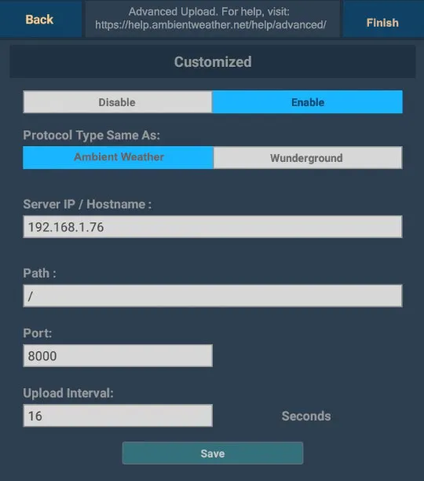
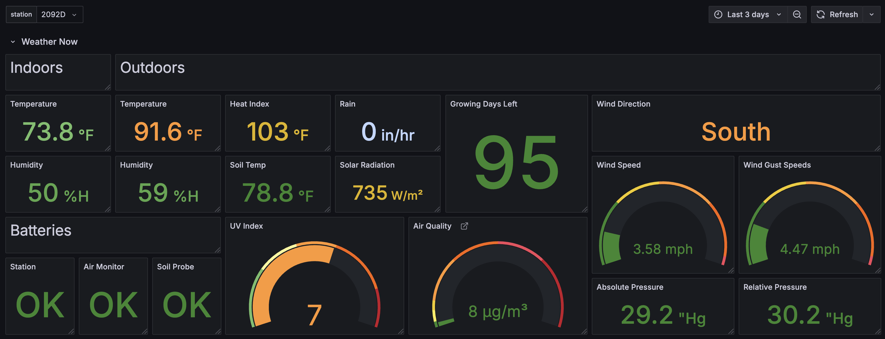
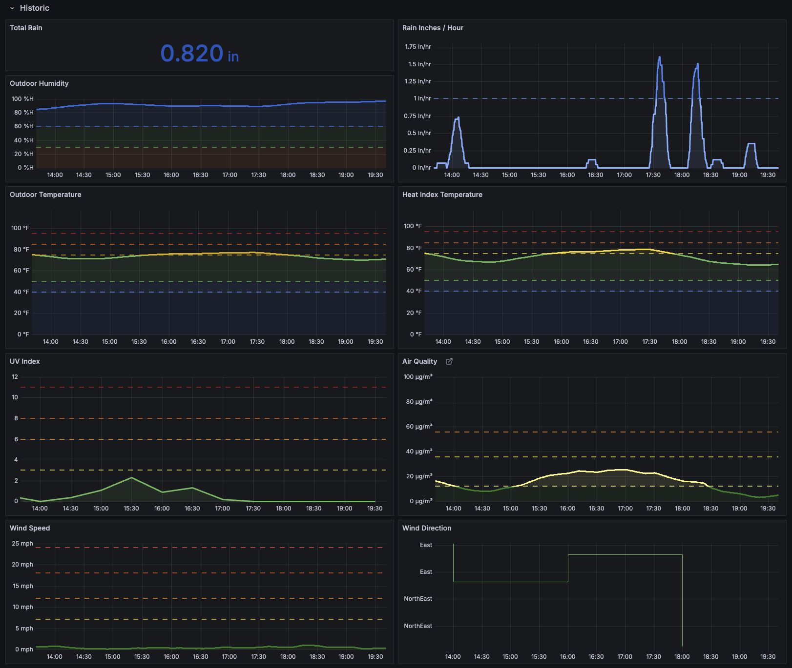

# Ambient Weather Protocol Exporter

A lightweight Prometheus exporter for [Ambient Weather Protocol](https://ambientweather.com/faqs/question/view/id/1857/) weather stations. This exporter listens for data
sent by AWP-compatible weather stations and converts measurements to Prometheus metrics. This exporter supports all AWP
stations with any number of connected sensors.

## Features

- **Minimal Cardinality**: Designed to provide essential metrics without excessive label cardinality to prevent large
  data ingestion footprints.
- **Dynamic Metrics**: Automatically creates appropriate metrics for all data reported by your device.
- **Lightweight**: Uses Go's built-in HTTP server and minimal external dependencies to run efficiently.
- **Request Mirroring**: Optionally mirror data to other services, like Ambient Weather's cloud services or other weather data collectors.

## Getting Started

### Prerequisites

- [Go](https://go.dev/) 1.23 or higher
- A compatible Ambient Weather Protocol device
- Prometheus (for scraping and storing metrics)


### Configuration

| Parameter | Description                            | Default |
|-----------|----------------------------------------|---------|
| `port`    | Port on which the AWP exporter listens | `6255`  |
| `v`       | Enable verbose (debug) logging         | `false` |
| `mirror-host` | Hostname to mirror requests to (enables mirroring when set) | `""` (disabled) |
| `mirror-port` | Port to mirror requests to | `8000` |
| `mirror-path` | Path to mirror requests to | `/data/report` |
| `mirror-https` | Use HTTPS for mirror requests | `false` |


### Manual Instal

```bash
go install github.com/Digital-Shane/awp-exporter@latest
```

#### Run the Exporter

```bash
awp-exporter
```

Optional flags:
```bash
# Change the port (default 6255)
awp-exporter -port=6256

# Enable verbose debug logging
awp-exporter -v

# Enable request mirroring to Ambient Weather
awp-exporter -mirror-host="rt.ambientweather.net"

# Enable request mirroring with all options
awp-exporter -mirror-host="example.com" -mirror-port=443 -mirror-path="/custom/path" -mirror-https
```

### Docker Install

AWP Exporter can be run as a Docker container.

#### Building the Docker Image

```bash
# Clone the repository
git clone https://github.com/Digital-Shane/awp-exporter.git
cd awp-exporter

# Build the Docker image
docker build -t awp-exporter .
```

#### Running the Docker Container

```bash
# Run the container with default settings
docker run -d --name awp-exporter awp-exporter

# Run with verbose logging
docker run -d --name awp-exporter awp-exporter -v
```

#### Docker Compose Example

```yaml
version: '3'
services:
  awp-exporter:
    build:
      context: .
    image: awp-exporter
    ports:
      - "6255:6255"
    restart: unless-stopped
```

### Configure Your Weather Station



1. Open your weather station's app or configuration interface
2. Navigate to the sensors Awnet Advanced settings
3. Enter your server's IP address
4. Use port `6255` (or the port you've configured)
5. Set the path to `/data/report/STATIONNAME` where `STATIONNAME` is a name you choose to identify this station
6. Choose the update interval that meets your needs

## Available Metrics

AWP Exporter dynamically generates metrics for all values provided by your weather station, with metrics formatted as:

```
awp_<parameter>{station="stationname"} value
```

Examples:
```
# HELP awp_hourlyrainin AWP sensor value for hourlyrainin
# TYPE awp_hourlyrainin gauge
awp_hourlyrainin{station="2092D"} 0
# HELP awp_humidity AWP sensor value for humidity
# TYPE awp_humidity gauge
awp_humidity{station="2092D"} 82
# HELP awp_uv AWP sensor value for uv
# TYPE awp_uv gauge
awp_uv{station="2092D"} 0
```

The full list of possible metrics depends on the sensors available in your specific weather station model. Reference
the [Ambient Weather Protocol specification](https://ambientweather.com/faqs/question/view/id/1857/) for details on possible parameters. This exporter parses parameters
dynamically, any new parameters added by ambient weather on newer devices will be picked up automatically. 

## Grafana Dashboard

A Grafana dashboard configuration is [included in this repository](./grafana.json). Import this file into your Grafana instance to
get started with visualizing your weather data. Note that this is my dashboard, and I have an optional air quality
monitor and sensor 1 set to monitor soil temperature. 




## Request Mirroring

By request I've added a handy feature that lets you mirror your weather data to other
services while still collecting it for Prometheus. This is perfect if you want to keep
using Ambient Weather's cloud services.

### How to Enable Mirroring

```bash
# Mirror to Ambient Weather's servers
awp-exporter -mirror-host="rt.ambientweather.net"

# For other services that use HTTPS
awp-exporter -mirror-host="example.com" -mirror-https -mirror-port=443 -mirror-path="/your/path"
```

## Prometheus Configuration

Add the following job to your Prometheus configuration:

```yaml
- job_name: 'awp_exporter'
  static_configs:
    - targets: ['localhost:6255']
```

## Contributing

Contributions are welcome! If you have any suggestions or encounter a bug, please open an [issue](https://github.com/Digital-Shane/awp-exporter/issues) or submit a pull request.

When contributing:

1. Fork the repository and create a new feature branch
2. Make your changes in a well-structured commit history
3. Include tests (when applicable)
4. Submit a pull request with a clear description of your changes

## License

This project is licensed under GNU General Public License v3.0 - see the [LICENSE](./LICENSE) file for details.

Happy weather monitoring!
